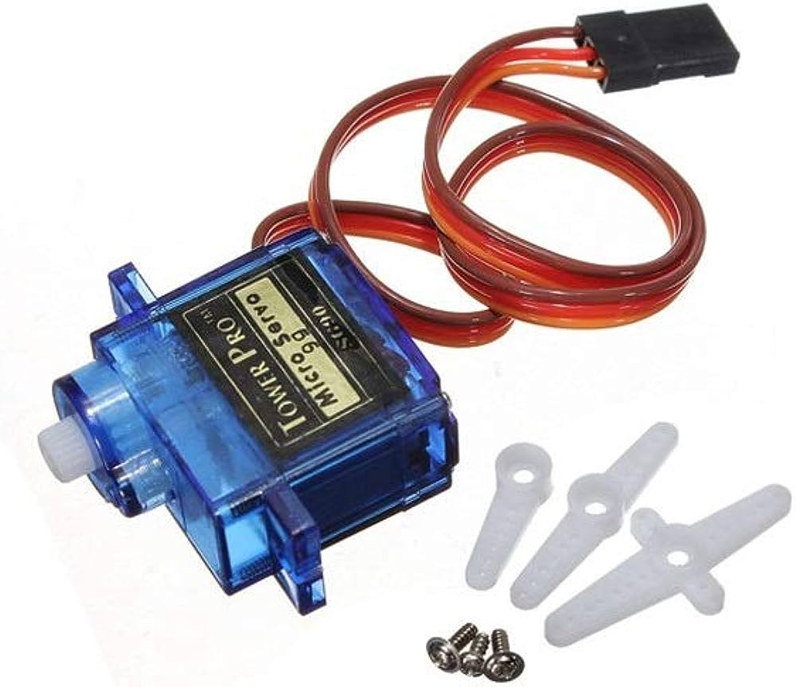
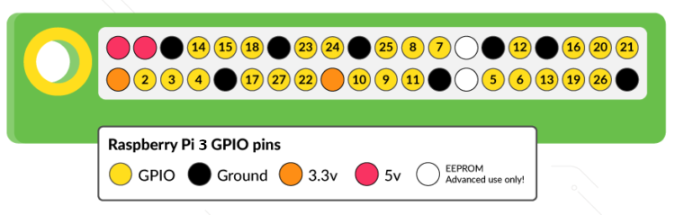
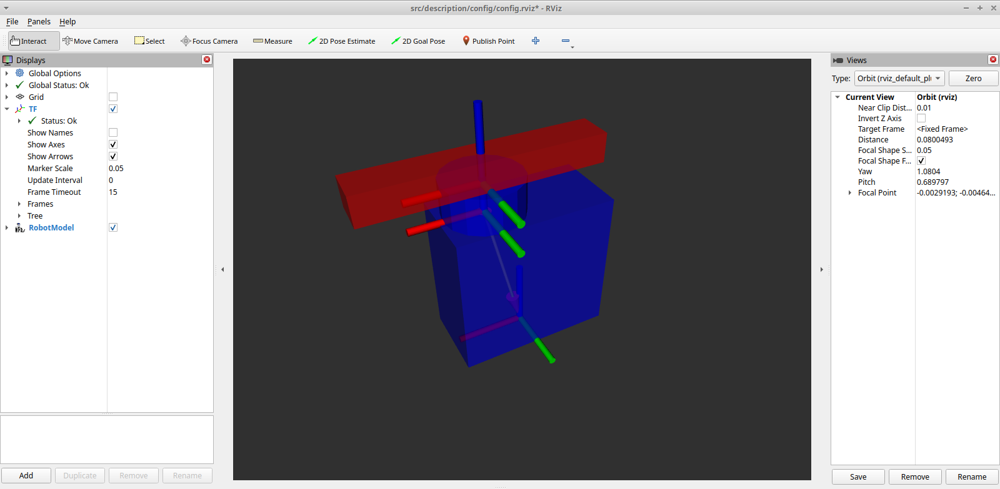

# Micro-servo S90 hardware interface for RaspberryPi 3B+
<p align="center">
  
</p>
The micro-servo S90 is a small, lightweight motorized device commonly used with Raspberry Pi or Arduino boards to control the precise movement of mechanical parts. It is compact, low-cost, and ideal for applications such as robotics, automation, and remote-controlled systems.

The <em>primary objective</em> of this repository is to develop and incorporate the hardware interface, enabling the utilization within the ROS (Robot Operating System) framework.

&NewLine;

For a better understanding and simple control (outside ROS) of the micro servo, see my other github project [S90_servo_motor](https://github.com/mataruzz/raspberryPi_components_tests/tree/main/S90_servo_motor), or looks at other [examples](https://www.circuitbasics.com/how-to-use-servos-on-the-raspberry-pi/).


## TO DO: describe hardware_interface implementation


## Configuration and Setup
To <strong>enable</strong> the utilization of this repository, the micro-servo S90's PWM wire <strong>must be connected</strong> to <strong>PIN 5</strong> (GPIO's pin enumeration, corresponding to physical PIN 29).

<p align="center">
  
</p>

### Used System
This repository has been designed for use with the following hardware and software:
- Raspberry Pi 3B+
- Ubuntu Server 22.04 LST
- ROS2 Humble

### Installation 
Once the hardware connection is ensured, access to the Raspberry (e.g., SSH) and:

* Clone the repository both on your PC (to visualize the simulation) and Raspberry (to send actual signals):
```
cd ~/
git clone https://github.com/mataruzz/ROS2_servo_motion
```
* Build the repository (limitating the number of threads) on the Raspberry:
```
cd ~/ROS2_servo_motion
colcon build --parallel-workers 2 --executor sequential
```
### Run the example
In the following example, 5 positions are defined and iteratevely passed to the controller.

***Inside the RaspberryPi***:

* Source the ws: 
```
cd ~/ROS2_servo_motion
source install/setup.bash
```
* Run the controllers:
```
ros2 launch bringup S90_servo.launch.py
```
* Run the example:
```
ros2 launch bringup test_fordware_position_controller.launch.py
```
Another way to send to the controller the target position is to write directly on the controller topic:
```
ros2 topic pub /forward_position_controller/commands std_msgs/msg/Float64MultiArray "data:
- 3.14"
```
The above example script nothing do more than sending to the controller the desired position every second.

***On your PC:*** 
* Open Rviz:
```
rviz2 -d ~/ROS2_servo_motion/src/description/config/config.rviz
```
You will see the following model:
<p align="center">
  
</p>


## Expected result
If everything works as expected, you should be able to see the physical micro-servo S90 moving to 5 different positions ([0, 0.785, 1.57, 2.36, 3.14] rads), in loop.
In addition, the movement will be also simulated in the RViz environment, as shown below:

<p align="center">
  
</p>

## **Pros** and **Cons** of the project
In this section, I'll try to highlight pros and cons of this hardware-interface, with the aim to make clear the whole project:

<p align="center">

|    <p align="center"> **Pros**   </p>    |           <p align="center"> **Cons**   </p>               |
|:-------------|---------------------------|
| **Hardware Integration:** The capacity to effectively communicate with physical devices is demonstrated through the construction of a hardware interface for the micro servo S90. |   **Scalability Concerns:** You can run into scalability problems that need to be handled if you integrate more hardware or devices into your project. <br/>  <br /> <br />|
| **Raspberry Pi Compatibility:** As a control platform, the Raspberry Pi 3B+ offers a variety of advantages, including as price, a strong community and ecosystem, and usability. <br /> <br /> <br /> <br /> <br />| **Limited Control Precision:** It is difficult to achieve high precision when feedback mechanisms is missing. Due to the lack of a closed loop control system, the current configuration of the project is susceptible to disturbances and inaccuracies in servo positioning, which can restrict precision and robustness.|
| **Open Source Framework (ROS2) compatibility:** Embracing ROS2 simplifies integration with hardware interfaces and opens a framework that is modular, reusable, and reliable. As part of the ROS2 community, you have access to a vast network of experts, collaborators, and enthusiasts. | **Lack of Trajectory Tracking:** The lack of trajectory control means that the servo cannot smoothly follow a predefined path or perform complex motions. This is often important in applications that require dynamic and precise behavior. <br /> <br /> <br /> |
| **Position Control:** Achieving open-loop position control, even if simple and inaccurate, is an important part of advanced control technology and indicates progress toward project goals. |     **Presence of Jitter:** A notable drawback is the presence of jitter caused by using an inaccurate square wave for control (generated by the RaspberryPi 3B+). This can lead to unwanted fluctuations and instability.   |

</p>

## Future development:

